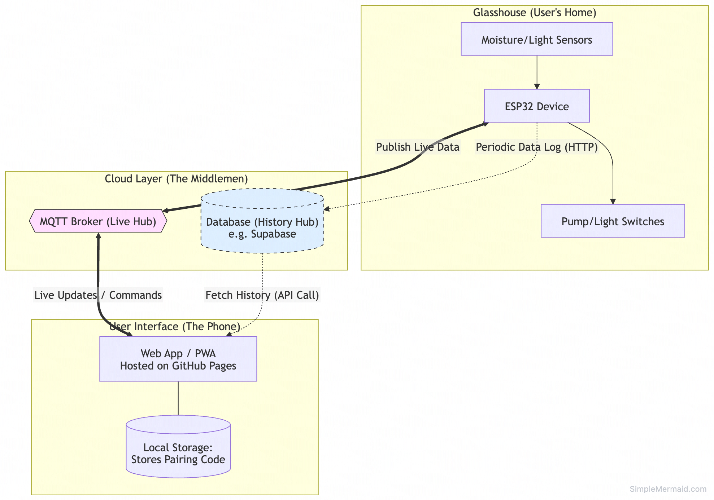

# project structure
## phase 1: live updates
This setup is fast, private, and costs $0 to run. It acts like a "Live Dashboard" that shows what is happening right now.
Setup (The First Boot): The ESP32 starts in Access Point mode. The user connects their phone to the "Glasshouse-Setup" Wi-Fi. A Captive Portal pops up where they enter their home Wi-Fi password. The device saves this and reboots.

* **Identification (The Pairing):** Each device uses its unique MAC Address to generate a 4-digit Pairing Code(e.g., B2A1). The user types this into your Web App.
* **The UI (The Frontend):** Your Web App is a collection of static files (HTML/JS/CSS) hosted on GitHub Pages. When opened, the app saves the Pairing Code to the phone’s Local Storage so the user never has to log in.
* **Communication (The Broker):** The ESP32 and the Web App both connect to a Cloud MQTT Broker (like HiveMQ Cloud).
    * Data Out: ESP32 publishes to glasshouse/B2A1/sensors.
    * Commands In: The Web App publishes to glasshouse/B2A1/commands.
    * Data Retention: None. If the app is closed, the data is gone until it is opened again.

## phase 2: added historical data
When you are ready to show 24-hour graphs or moisture trends, you simply plug a database into the existing "Middleman."

* **The Database (The Memory):** You add a service like Supabase or Appwrite. These are open-source and respect privacy better than the "Big Tech" giants.
* **The Data Logger:**
    * **Option A:** You write a tiny "Listener" (a server-side script) that stays connected to the MQTT Broker and saves every message into the database.
    * **Option B:** The ESP32 sends a second message via an HTTP Post directly to the database every 10 minutes.
* **The UI Upgrade:** Your Web App still gets "Live" data from MQTT for the buttons and current gauges, but it now also sends a request to the Database to ask for: "Give me all readings for B2A1 from the last 7 days." This data is then rendered into a beautiful chart (using a library like Chart.js).

## schematic: workflow
This diagram shows how Phase 1 (Solid lines) and Phase 2 (Dashed lines) live together.

## motivation
* **Privacy by Design:** You aren't storing emails or passwords. If your database were hacked, the only thing leaked is a bunch of moisture readings tied to a random code like B2A1.
* **Zero Maintenance:** Since the frontend is static (GitHub) and the broker/database are managed services, you don't have to worry about Linux server security patches or crashes.
* **Cost:** You could likely run 50–100 devices on the free tiers of these services before ever seeing a bill.
